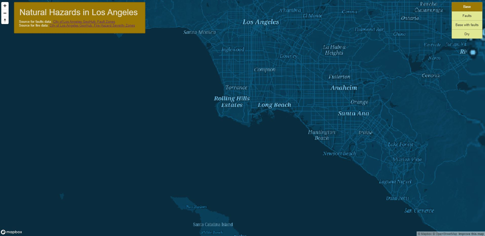
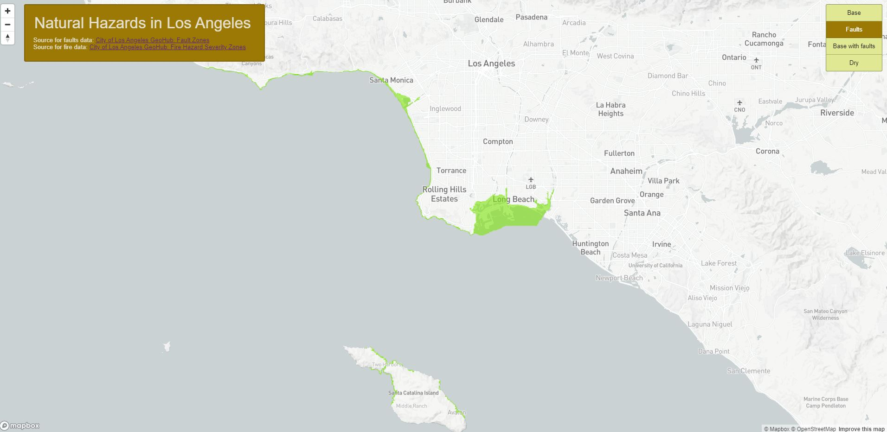
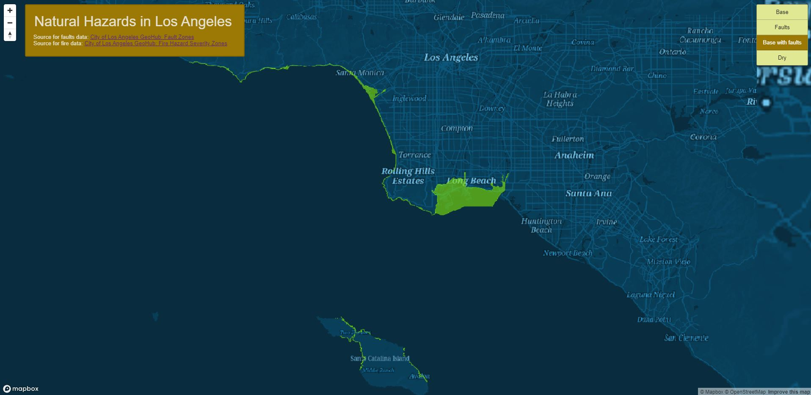
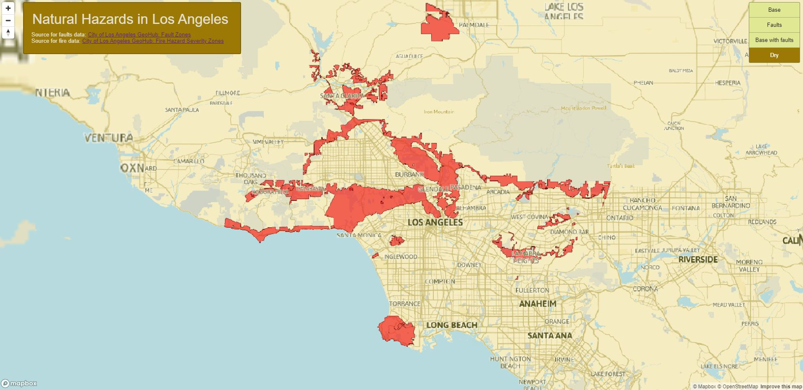

# Natural Hazards in Los Angeles

[Link to webmap](https://sarahg9.github.io/earthquakehazardsLA/index.html)

This map shows areas in Los Angeles that are at a high risk for earthquake damage and fires. The datasets were from the [City of Los Angeles' GeohHub](https://geohub.lacity.org/). The map was also used to explore tiles and includes a created basemap. The range of zoom levels and the bounding box were reduced in order to save storage, not exceed GitHubs's data limits, and mitigate the risk of the author's computer crashing. 

## Basemap

Zoom Level: min 7, max 13
Tile Width: 256 pixels

This tileset is an altered verison of a [Mapbox basemap](https://www.mapbox.com/gallery/). The font was changed as well as the base color. Some place labels were eliminated because they did not seem relevant to topic. 

## Faults

Zoom Level: min 7, max 13
Tile Width: 256 pixels

This tileset includes areas of the city that are designated as fault zones and therefore are at a high risk for earthquake damage. The [data source](https://geohub.lacity.org/datasets/lacounty::fault-zones/explore?location=33.983645%2C-118.105343%2C10.00) mentions that the data helps inform the placement of "buildings for human occupancy."

## Basemap with Faults

Zoom Level: min 7, max 13
Tile Width: 256 pixels

The third tileset is like a combination of the first two and uses green to constrast the fault zones from the surrounding area. 

## Dry Themed Map

Zoom Level: min 7, max 13
Tile Width: 256 pixels

The map uses earthy and yellowish or brown colors to suggest the dryness of the region. A more muted shade of blue is used to demphasize the water. Zones of severe fire risk are shown in orange. Cities names were made to be larger and bolder to show the relevance of issues like drought and wildfire to high population areas. Originally, the map was planned to show liquefaction risk areas in order to align with the other's map topic of earthquake hazards. However, the available liquefaction data had a relatively high minimum zoom number which made it difficult to see the data without zooming in a lot. 